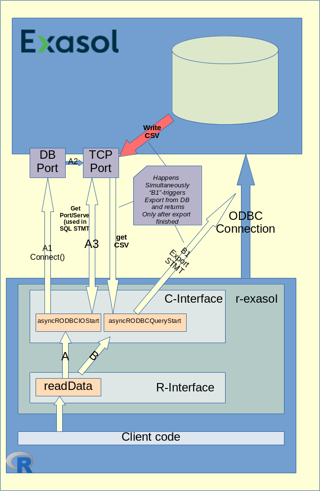

# Script-Languages-Container-Tool Developer Guide

r-exasol is a R library providing access to an Exasol DB. 
This document is about the inner working of r-exasol.


## Problem Statement:
As described in the [README.md](../../README.md):
>'It is optimised for fast reading & writing from and to a multinode cluster.'
> 
This document will describe how the r-exasol library reads/write data from/to the database from high level perspective.
The focus is hereby on the functions which leverage the fast data transfer, as the other functions make usage of standard DBI / RODBC functions.

## Implementation

### Connection

When the client calls dbConnect(), the library connects to the Exasol DB via RODBC, this happens in ```EXADBI.R```:
```r
    EXANewConnection <- function(...)
    ...
    odbcDriverConnect(...)
```

### Data Exchange

Once the connection is ready, the client can read data or manipulate data using basically two functions:

```r
    exa.readData()
    exa.writeData()
```

Some of the standard SQL functions use internally one of those two methods, for example ```dbGetQuery()```,
but that is not always the case.

### Internal data flow when reading from database

The following diagram shows the internal data flow when the client invokes ```exa.readData()```:



When the client invokes ```readData()``` the library reads the server info (hostname/port) from the ODBC connection and establishes a TCP socket (A1). When the server receives a connection request on the listening port it creates another TCP port (A2) which will be used for data transfer. As last step within ```asyncRODBCIOStart()``` the client reads the information of the new port (A3), which it will need to prepare the export SQL statements. 
Then the librart calls```asyncRODBCQueryStart()``` creates internally a new thread which sends the export statements via ODBC to the server (B1). The server then starts to write the data in CSV format to the formerly created TCP socket. Thus, the client receives the data from the server via the socket (not via ODBC). 


